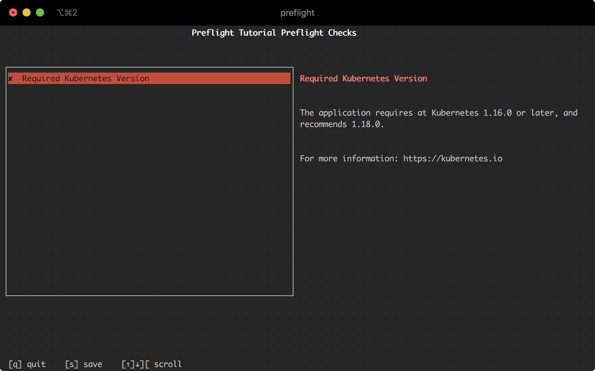
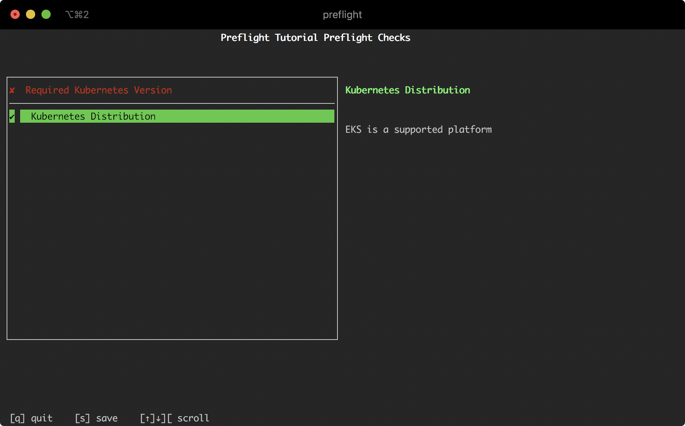

In this step, we'll add a few basic preflight checks to:

1. Verify the version of Kubernetes is supported
2. Verify that the cluster is running in a supported managed Kubernetes provider

These checks are designed to show how easy it is to add new preflight checks to an application.

## Create a `preflight.yaml`

To start, create a new file on your computer named `preflight.yaml` and paste the following content into it:

```yaml
apiVersion: troubleshoot.sh/v1beta2
kind: Preflight
metadata:
  name: preflight-tutorial
spec:
  analyzers: []
```

> Note: `troubleshoot.sh/v1beta2` was introduced in preflight and support-bundle krew plugin version 0.9.39 and Kots version 1.19.0. Kots vendors should [read the guide to maintain backwards compatibility](/v1beta2/).

We aren't going to deploy this file to our cluster.
Once you've saved this file, let's run it using the `kubectl` plugin:

```shell
kubectl preflight ./preflight.yaml
```

When you execute this command, you should see a spinner while the Preflight application is running, and then a message that says:

```shell
Error: no data has been collected
```

We now have the basic workflow of executing preflight checks, we just haven't defined any checks yet.

## Check Kubernetes Version

Let's add a check that has a minimum and a recommended Kubernetes version.
We want to show a warning message if the Kubernetes cluster is not at the recommended version, and show an error message if it's below the minimum version.
For this example, let's assume that our application requires Kubernetes 1.16.0 or higher, and we recommend 1.18.0 or higher.

Edit the `./preflight.yaml` and add a new analyzer:

```yaml
apiVersion: troubleshoot.sh/v1beta2
kind: Preflight
metadata:
  name: preflight-tutorial
spec:
  analyzers:
    - clusterVersion:
        outcomes:
          - fail:
              when: "< 1.16.0"
              message: The application requires at least Kubernetes 1.16.0, and recommends 1.18.0.
              uri: https://kubernetes.io
          - warn:
              when: "< 1.18.0"
              message: Your cluster meets the minimum version of Kubernetes, but we recommend you update to 1.18.0 or later.
              uri: https://kubernetes.io
          - pass:
              message: Your cluster meets the recommended and required versions of Kubernetes.
```

Let's review the changes to this YAML:

**Line 7**: We are adding a new `clusterVersion` analyzer to be evaluated when Preflight Checks are running.
This key tells the Preflight application how to interpret and parse the `outcomes` below.
The documentation for `clusterVersion` is in the [Analyze documentation](/analyze/cluster-version/).

**Line 8**: We are defining all possible outcomes for this analysis.
An outcome is the result of a preflight analysis.
Outcomes are evaluated in order, much like a switch statement is evaluated in code.
If an outcome matches, then execution of this preflight terminates with the result being the matching outcome.

**Lines 9-12**: We are defining an outcome where where the message, icon and colors will be "fail".
The `clusterVersion` analyzer accepts semver ranges for the `when` clause, and we are declaring that all versions of Kubernetes less than 1.16.0 will match this outcome.
Finally, we are defining the mewssage and URI to show in the results, when this outcome matches.

**Lines 13-16**: Much like the failure outcome above, we are defining a warning level outcome for Kubernetes versions less than 1.18.0.
Because the failure outcome is listed above this outcome, all Kubernetes versions less than 1.16.0 will already be removed from analysis.

**Lines 17-18**: Finally, we are defining a pass outcome for any analysis that makes it this far.
We don't need to include a `when` clause because this is the default outcome at this point.

Just like before, save and execute these preflight checks with:

```shell
kubectl preflight ./preflight.yaml
```

It will take a few seconds for the Preflight Checks to collect the required data, and then you'll see a screen similar to below.
Note that you might see a failure, warning or pass message, depending on the version of Kubernetes you are running.



You can press `q` to exit this screen.

## Adding Cluster Provider

Let's continue this and add a preflight check that verifies that the cluster is running on a supported *distribution* of Kubernetes.
Once again, we have three categories (pass, warn and fail) that we want to check for.
To write this preflight check, assume that our application does not work on Docker Desktop or Microk8s.
Our application is known and validated on Amazon EKS, Google GKE, and Azure AKS.
Any other distribution is supported on a best-effort basis and not validated.

To add this check, open that `./preflight.yaml` again and edit the contents to match:

```yaml
apiVersion: troubleshoot.sh/v1beta2
kind: Preflight
metadata:
  name: preflight-tutorial
spec:
  analyzers:
    - clusterVersion:
        outcomes:
          - fail:
              when: "< 1.16.0"
              message: The application requires at least Kubernetes 1.16.0, and recommends 1.18.0.
              uri: https://kubernetes.io
          - warn:
              when: "< 1.18.0"
              message: Your cluster meets the minimum version of Kubernetes, but we recommend you update to 1.18.0 or later.
              uri: https://kubernetes.io
          - pass:
              message: Your cluster meets the recommended and required versions of Kubernetes.
    - distribution:
        outcomes:
          - pass:
              when: "== gke"
              message: GKE is a supported platform
          - pass:
              when: "== aks"
              message: AKS is a supported platform
          - pass:
              when: "== eks"
              message: EKS is a supported platform
          - fail:
              when: "== docker-desktop"
              message: This application does not support Docker Desktop
          - fail:
              when: "== microk8s"
              message: This application does not support Microk8s
          - warn:
              message: The Kubernetes platform is not validated, but there are no known compatibility issues.
```

Reviewing this YAML, we've added an additional analyzer in the `analyzers` key.
This analyzer uses the built in [distribution](/analyze/distribution/) check that has the capabilities of detecting where the cluster is located.

Once again, save and run this file with:

```shell
kubectl preflight ./preflight.yaml
```

After collecting and analyzing, you'll see a screen similar to below:



You can use the arrow keys to move up and down to select different preflight checks and see the results.

Again, press `q` to exit when finished.
