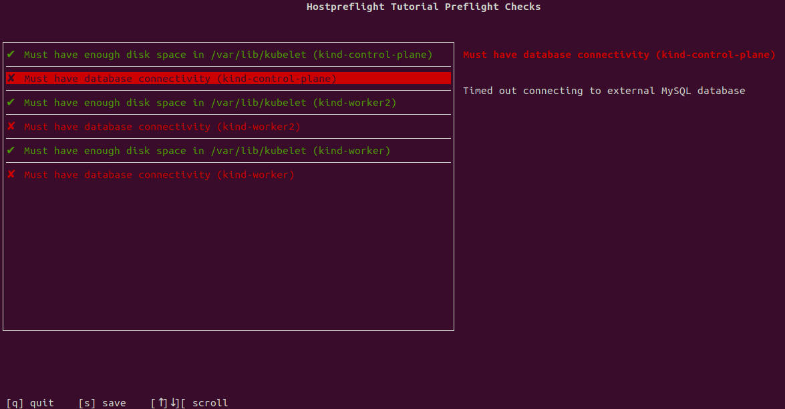

In this step, we'll add HostPreflight Checks to:

1. Verify that all nodes have at least 10 GB of disk space available in /var/lib/kubelet
2. Verify that all nodes can connect to an external TCP service.

## Create a `host-preflight.yaml`

To start, create a new file on your computer named `host-preflight.yaml` and paste the following content into it:

```yaml
apiVersion: troubleshoot.sh/v1beta2
kind: HostPreflight
metadata:
  name: hostpreflight-tutorial
spec:
  analyzers: []
```

> Note:  On line 2, we are using the `HostPreflight` kind instead of
`Preflight`.  The `HostPreflight` kind allows us to run [Host Collectors](/collect/#host-collectors), either
on the current node or on remote nodes.

We aren't going to deploy this file to our cluster.
Once you've saved this file, let's run it using the `kubectl` plugin:

```shell
kubectl preflight ./host-preflight.yaml
```

When you execute this command, you should see a spinner while the Preflight application is running, and then a message that says:

```shell
Error: no results
```

We now have the basic workflow of executing host preflight checks, we just haven't defined any checks yet.

## Verify disk space

Let's add a HostPreflight Check to show an error message if any nodes have less
than 10 GB of space available in `/var/lib/kubelet`, and a warning if any have
less than 80% of their total space available.

To add this check, open `./host-preflight.yaml` again and edit the contents to match:

```yaml
apiVersion: troubleshoot.sh/v1beta2
kind: HostPreflight
metadata:
  name: hostpreflight-tutorial
spec:
  remoteCollectors:
    - diskUsage:
        path: /var/lib/kubelet
  analyzers:
    - diskUsage:
        checkName: Must have enough disk space in /var/lib/kubelet
        outcomes:
          - fail:
              when: "available < 10Gi"
              message: /var/lib/kubelet has less than 10Gi of disk space available
          - warn:
              when: "used/total > 80%"
              message: /var/lib/kubelet is more than 80% full
          - pass:
              message: /var/lib/kubelet has sufficient disk space available
```

Let's review the changes to this YAML:

**Line 7**: We are adding the `diskUsage` collector as a `remoteCollector`.
Remote collectors run on the Kubernetes cluster nodes.  If it was added as a
`collector`, it would run on the local host.  The `diskUsage` collector requires
a filesystem path.

**Line 10**: We are adding a new `diskUsage` analyzer to be evaluated when HostPreflight Checks are running.
This key tells the Preflight application how to interpret and parse the `outcomes` below.
The documentation for `diskUsage` is in the [Analyze documentation](/analyze/disk-usage/).

**Line 12**: Provide a custom title to show up on the results page for this check.
This attribute is available for any analyzer.

**Line 13**: The following section will define the possible outcomes of this analyzer.

**Line 14**: Define the failure outcome first.
This outcome will be evaluated and, if true, evaluation of this analyzer will stop.

**Line 15**: The criteria for this analyzer to evalate.
We are providing a basic analyzer here that simply checks if available space is less than 10Gi.  
If this is evaluates to true, then this analyzer will have the current outcome (fail) and stop processing.

**Line 16**: The message to show when this outcome is true.

**Line 17**: Define the warn outcome next.
We are providing a basic analyzer here that checks if the used space is greater
than 80% of the total space.

**Line 18**: This is the message to show for the warn outcome.

**Line 19**: Define the pass outcome next.
There is no `when` attribute on this outcome, so it's the catch-all.

**Line 20**: This is the message to show for the pass outcome.

## Verify connectivity to a remote service

Next, we will add another analyzer to ensure that all hosts can connect to a
remote TCP service.

To add this check, open `./host-preflight.yaml` again and edit the contents to match:

```yaml
apiVersion: troubleshoot.sh/v1beta2
kind: HostPreflight
metadata:
  name: hostpreflight-tutorial
spec:
  remoteCollectors:
    - diskUsage:
        path: /var/lib/kubelet
    - tcpConnect:
        address: 10.0.0.1:3306
        timeout: 5s
  analyzers:
    - diskUsage:
        checkName: Must have enough disk space in /var/lib/kubelet
        outcomes:
          - fail:
              when: "available < 10Gi"
              message: /var/lib/kubelet has less than 10Gi of disk space available
          - warn:
              when: "used/total > 80%"
              message: /var/lib/kubelet is more than 80% full
          - pass:
              message: /var/lib/kubelet has sufficient disk space available
    - tcpConnect:
        checkName: Must have database connectivity
        outcomes:
          - fail:
              when: "connection-refused"
              message: Connection to external MySQL database was refused
          - fail:
              when: "connection-timeout"
              message: Timed out connecting to external MySQL database
          - fail:
              when: "error"
              message: Error connecting to external MySQL database
          - pass:
              when: "connected"
              message: Successfully connected to external MySQL database
```

Let's review the additions to the YAML:

**Line 9**: We added the `tcpConnect` collector as a `remoteCollector` so that
it runs on all cluster nodes.

**Line 10**: We configured the collector to check `address: 10.0.0.1:3306`.

**Line 11**: We set a connection timeout of `5s` (5 seconds).

**Line 24**: We added the `tcpConnect` analyzer.

**Line 25**: Provide a custom title to show up on the results page for this check.
This attribute is available for any analyzer.

**Line 26**: The following section will define the possible outcomes of this analyzer.

**Line 27**: Define the failure outcome first.
This outcome will be evaluated and, if true, evaluation of this analyzer will stop.

**Line 28**: The criteria for this analyzer to evalate.
The `tcpConnect` collector can return, `connection-timeout`,
`connection-refused`, `error` or `connected`.
If this is evaluates to true, then this analyzer will have the current outcome (fail) and stop processing.

**Line 29**: The message to show when this outcome is true.

**Line 30-35**: Define additional failure outcome fors `connection-refused` and
`error`.  Multiple failure outcomes allow us to provide more meaningful
messages.

**Line 36**: Define the pass outcome next.

**Line 37**: This outcome will be true if the collector returned a `connected` response.

**Line 38**: This is the message to show for the pass outcome.

## Executing the preflights

Let's stop here and execute the preflight checks.
For this demo, I'm running this on my local Kubernetes cluster that has 3 nodes, but the database server is blocked by a firewall.
The expectation here is that my local cluster will pass on the disk space check, but fail on the remote service check.

I'll run this file using:

```shell
kubectl preflight ./host-preflight.yaml
```

And the results are:



You can see the outcome for each cluster node, with the node's name in brackets
(e.g. `kind-control-plane`).

## Next Steps

Continue to the final part of this tutorial to learn how to distribute Preflight Checks as part of your application or documentation.
