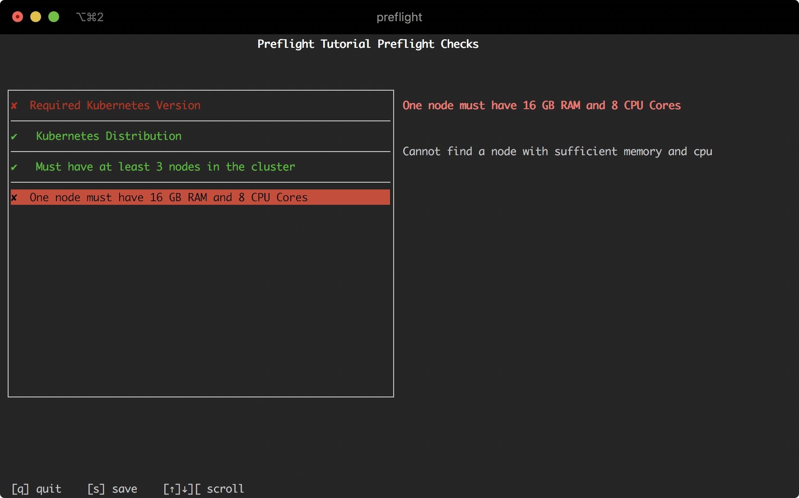

In this step, we'll expand the Preflight Checks we've already added to:

1. Verify that the cluster has at least 3 nodes
2. Verify that at least 1 node in the cluster has 16 GB of RAM and 8 CPUs

## Verify node count

Let's add a Preflight Check to show an error message if the cluster does not have at least 3 nodes.

To add this check, open that `./preflight.yaml` again and edit the contents to match:

```yaml
apiVersion: troubleshoot.sh/v1beta2
kind: Preflight
metadata:
  name: preflight-tutorial
spec:
  analyzers:
    - clusterVersion:
        outcomes:
          - fail:
              when: "< 1.16.0"
              message: The application requires at least Kubernetes 1.16.0, and recommends 1.18.0.
              uri: https://kubernetes.io
          - warn:
              when: "< 1.18.0"
              message: Your cluster meets the minimum version of Kubernetes, but we recommend you update to 1.18.0 or later.
              uri: https://kubernetes.io
          - pass:
              message: Your cluster meets the recommended and required versions of Kubernetes.
    - distribution:
        outcomes:
          - pass:
              when: "== gke"
              message: GKE is a supported platform
          - pass:
              when: "== aks"
              message: AKS is a supported platform
          - pass:
              when: "== eks"
              message: EKS is a supported platform
          - fail:
              when: "== docker-desktop"
              message: This application does not support Docker Desktop
          - fail:
              when: "== microk8s"
              message: This application does not support Microk8s
          - warn:
              message: The Kubernetes platform is not validated, but there are no known compatibility issues.
    - nodeResources:
        checkName: Must have at least 3 nodes in the cluster
        outcomes:
          - fail:
              when: "count() < 3"
              message: This application requires at least 3 nodes
          - pass:
              message: This cluster has enough nodes.
```


Reviewing this YAML, we've added an additional analyzer in the `analyzers` key starting at line 38.

Let's review the changes to this YAML:

**Line 38**: We are adding a new `nodeResources` analyzer to be evaluated when Preflight Checks are running.
This key tells the Preflight application how to interpret and parse the `outcomes` below.
The documentation for `nodeResources` is in the [Analyze documentation](/analyze/node-resources/).

**Line 39**: Provide a custom title to show up on the results page for this check.
This attribute is available for any analyzer.

**Line 40**: The following section will define the possible outcomes of this analyzer.

**Line 41**: Define the failure outcome first.
This outcome will be evaluated and, if true, evaluation of this analyzer will stop.

**Line 42**: The criteria for this analyzer to evalate.
We are providing a basic analyzer here that simply checks if the total count of the nodes is less than three.
If this is evaluates to true, then this analyzer will have the current outcome (fail) and stop processing.

**Line 43**: The message to show when this outcome is true.

**Line 44**: Define the pass outcome next.
There is no `when` attribute on this outcome, so it's the catch-all.

**Line 45**: This is the message to show for the pass outcome.

## Node Memory and CPU Requirements

Next, we will add another analyzer to ensure that at least 1 node has a minimum of 16 GB of RAM and 8 CPU cores available.

To add this check, open that `./preflight.yaml` again and edit the contents to match:

```yaml
apiVersion: troubleshoot.sh/v1beta2
kind: Preflight
metadata:
  name: preflight-tutorial
spec:
  analyzers:
    - clusterVersion:
        outcomes:
          - fail:
              when: "< 1.16.0"
              message: The application requires at least Kubernetes 1.16.0, and recommends 1.18.0.
              uri: https://kubernetes.io
          - warn:
              when: "< 1.18.0"
              message: Your cluster meets the minimum version of Kubernetes, but we recommend you update to 1.18.0 or later.
              uri: https://kubernetes.io
          - pass:
              message: Your cluster meets the recommended and required versions of Kubernetes.
    - distribution:
        outcomes:
          - pass:
              when: "== gke"
              message: GKE is a supported platform
          - pass:
              when: "== aks"
              message: AKS is a supported platform
          - pass:
              when: "== eks"
              message: EKS is a supported platform
          - fail:
              when: "== docker-desktop"
              message: This application does not support Docker Desktop
          - fail:
              when: "== microk8s"
              message: This application does not support Microk8s
          - warn:
              message: The Kubernetes platform is not validated, but there are no known compatibility issues.
    - nodeResources:
        checkName: Must have at least 3 nodes in the cluster
        outcomes:
          - fail:
              when: "count() < 3"
              message: This application requires at least 3 nodes
          - pass:
              message: This cluster has enough nodes.
    - nodeResources:
        checkName: One node must have 16 GB RAM and 8 CPU Cores
        filters:
          allocatableMemory: 16Gi
          cpuCapacity: "8"
        outcomes:
          - fail:
              when: count() < 1
              message: Cannot find a node with sufficient memory and cpu
          - pass:
              message: Sufficient CPU and memory is available
```

Reviewing this new analyzer, the interesting parts are lines 48-50 where we add filters.
Filters will filter the nodes analyzed to match the specified values.
In this case, we are filtering the list of nodes to those that have at least 16Gi of allocatable memory and 8 CPUs.
By filtering, we can use the simple `count()` function in the outcomes to analyze the results.

## Executing the preflights

Let's stop here and execute the preflight checks.
For this demo, I'm running this on my local Kubernetes cluster that has 5 nodes, but each node only has 2 cores and 8GB of RAM.
The expectation here is that my local cluster will pass on the 3 node minimum check, but fail on the second one because I do not have sufficient memory and CPU.

I'll run this file using:

```shell
kubectl preflight ./preflight.yaml
```

And the results are:



## Next Steps

Continue to the next part of this tutorial to learn how to run preflight checks on remote nodes.
